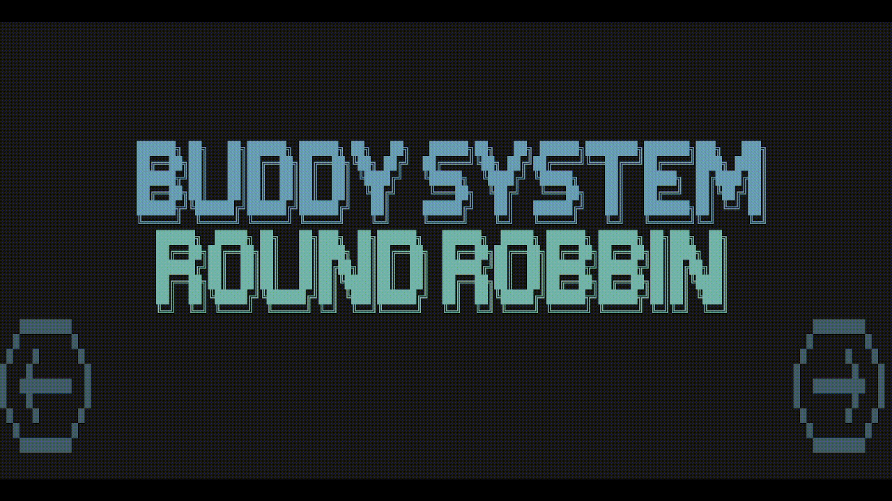

# Simulador de Round Robin y Buddy System

Este proyecto es un simulador de algoritmos de planificación de procesos y gestión de memoria, específicamente **Round Robin** y **Buddy System**, desarrollado en **C++** como parte de la materia de **Sistemas Operativos**. El simulador incluye una interfaz de texto amigable que permite al usuario interactuar con el sistema, configurar parámetros, observar estadísticas y controlar la ejecución de la simulación.

---

## Características Principales

### Interfaz
- **Interfaz de texto amigable**: Diseñada para facilitar la interacción del usuario.
- **Información en tiempo real**:
  - Lista de procesos en cola.
  - Proceso en ejecución.
  - Representación gráfica de la memoria.
  - Validación del algoritmo Round Robin.
  - Información detallada del estado del Buddy System.

### Funcionalidad
- **Configuración de parámetros**:
  - Quantum de procesamiento por proceso.
  - Tamaño máximo de la memoria.
  - Tamaño máximo del quantum de procesamiento.
- **Restricciones**:
  - Tamaño de memoria fijo (1 MB, 4 MB, 8 MB).
  - Tamaño mínimo de división de memoria (32 KB).
- **Procesos**:
  - Generación automática y aleatoria de procesos.
  - Siempre hay un proceso listo para entrar en la cola.
- **Estadísticas**:
  - Tiempo promedio de atención a procesos.
  - Número total de procesos atendidos.
  - Porcentaje de memoria utilizada.
- **Control de velocidad**:
  - El usuario puede ajustar la velocidad de la simulación.
- **Condición de paro**:
  - El usuario puede detener la simulación en cualquier momento.

---

## Dependencias

### Windows
- **Compilador GCC**: Puede instalarse a través de [MSYS2](https://www.msys2.org/).
- **Librerías estándar de C++**.

### Linux/MacOS
- **Librerías ncurses y ncurses-dev (ncurses-devel en algunas distribuciones)**: 